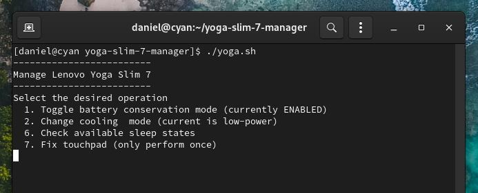

# yoga-slim-7-manager

This tool serves to toggle a selection of useful features which are hard to get to on Linux. Tested for Arch Linux and should work for its derivatives. Only works for Yoga Slim 7 14ARE05, do not attempt to use this tool without change on a different device. I will very probably add more features to this, this is an early version and may have a few bugs. Please use the latest kernel, the cooling modes are a recent addition.

## Features

* Toggle battery conservation mode (charge limit to 60%)
* Change cooling mode (Low Power, Intelligent Cooling and Performance Mode)
* Check available sleep states
* Touchpad fix for Arch

refer to [this arch wiki link](https://wiki.archlinux.org/title/Lenovo_IdeaPad_7_14are05) for more details

## Prerequisites

First install acpi_call (or acpi_call-lts for LTS kernel, acpi_call-dkms for other kernels) for the ability to switch cooling modes... also load the kernel module: 

``sudo pacman -S acpi_call``

don't forget to reboot!

``sudo modprobe acpi_call``

## Usage

Use the curl command, or clone this repository and mark the script as executable. Run with superuser privileges.

#### Installation
``curl https://raw.githubusercontent.com/dhonus/yoga-slim-7-manager/main/yoga.sh >> yoga.sh``

``chmod +x yoga.sh``

``sudo ./yoga.sh``

quick battery conserve toggle:

``./yoga.sh --battery``

## Notes
The cooling mode will reset to the current mode selected in the BIOS upon every reboot.  

At this time this laptop works very well in Arch, only requiring a blacklist of "elan_i2c" to fix the touchpad inconsistency (see the touchpad fix in the tool).  

Other distributions should be simple enough to implement, but the laptop doesn't seem to perform too well on older systems.

